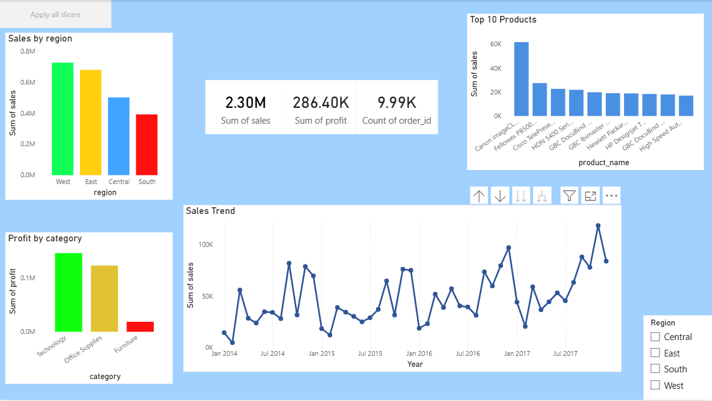

# 📊 Sales Insights Dashboard

## 📌 Project Overview

This project analyzes retail sales data to extract meaningful business insights and visualize them using an interactive Power BI dashboard.

The goal of this project is to demonstrate skills in:

* Data Cleaning
* SQL Analysis
* Exploratory Data Analysis (EDA)
* Data Visualization

---

## 🎯 Objectives

* Analyze sales performance across regions and categories
* Identify top-performing products
* Understand sales trends over time
* Detect loss-making products and areas

---

## 🛠️ Tools & Technologies Used

* **Python (Pandas, NumPy)** → Data Cleaning & EDA
* **SQL (SQLite)** → Data Analysis
* **Power BI** → Dashboard Creation
* **VS Code & CMD** → Development Environment
* **Git & GitHub** → Version Control

---

## 📂 Project Structure

```
Sales-Insights-Dashboard/
│
├── data/
│   ├── raw/
│   └── processed/
│
├── notebooks/
│   └── eda.ipynb
│
├── scripts/
│   └── load_to_db.py
│
├── sql/
│   └── analysis.sql
│
├── dashboard/
│   └── sales_dashboard.pbix
│
├── docs/
│   └── dashboard.png
│
└── README.md
```

---

## 🔄 Data Processing Steps

1. Loaded raw dataset using Pandas
2. Handled missing values and removed duplicates
3. Standardized column names
4. Converted date columns to proper format
5. Created new features (year, month, profit margin)
6. Saved cleaned dataset for further analysis

---

## 🧮 SQL Analysis

Performed SQL queries to extract insights:

* Total sales and profit
* Sales by region
* Top 10 products
* Monthly sales trends
* Loss-making products

---

## 📊 Exploratory Data Analysis (EDA)

* Sales distribution across regions
* Monthly sales trends
* Product performance analysis
* Profit vs Sales relationship
* Loss-making category analysis

---

## 📈 Dashboard Features (Power BI)

* KPI Cards (Total Sales, Profit, Orders)
* Sales Trend (Line Chart)
* Sales by Region
* Top 10 Products
* Profit by Category
* Interactive Slicer (Region Filter)

---

## 💡 Key Insights

* West region generated the highest sales
* Technology category yielded highest profit
* Few products contribute major revenue (Pareto effect)
* Some products generate high sales but low profit
* Identified loss-making products requiring attention

---

## 📷 Dashboard Preview



---

## 🚀 How to Run the Project

### 1. Clone Repository

```
git clone https://github.com/YOUR_USERNAME/Sales-Insights-Dashboard.git
cd Sales-Insights-Dashboard
```

### 2. Setup Environment

```
python -m venv venv
venv\Scripts\activate
pip install pandas numpy matplotlib seaborn
```

### 3. Run Data Processing

```
python scripts/load_to_db.py
```

### 4. Open Dashboard

Open Power BI file:

```
dashboard/sales_dashboard.pbix
```

---

## 🎤 Interview Explanation (Short)

This project analyzes sales data using Python and SQL to extract insights and visualizes them in Power BI.
It includes data cleaning, exploratory analysis, and an interactive dashboard to support business decision-making.

---

## 🙌 Author

**Sumanth G**

---

## ⭐ GitHub

If you found this project useful, feel free to star the repository!
